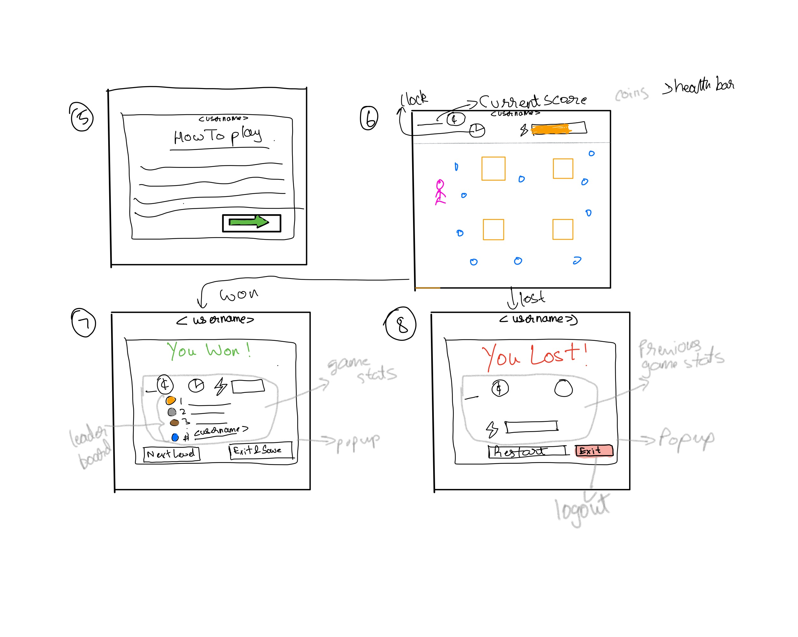
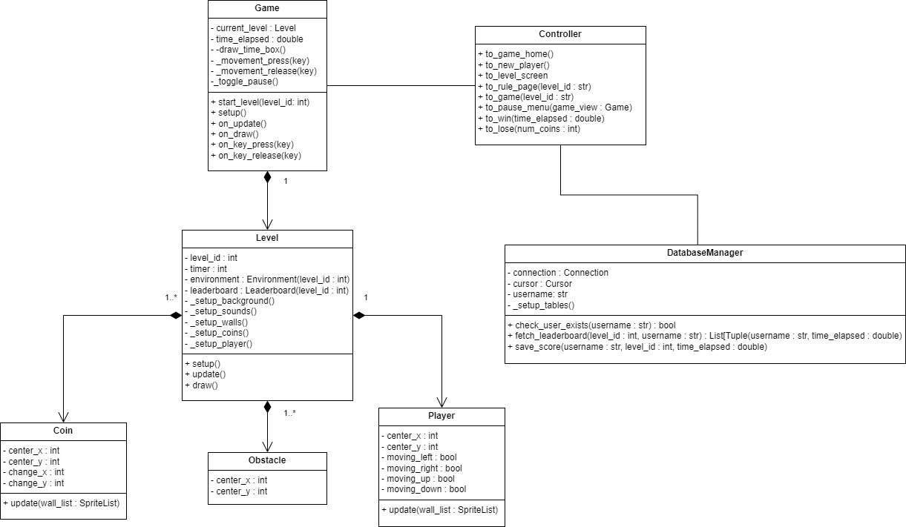

 > As you complete each section you **must** remove the prompt text. Every *turnin* of this project includes points for formatting of this README so keep it clean and keep it up to date. 
 > Prompt text is any lines beginning with "\>"
 > Replace anything between \<...\> with your project specifics and remove angle brackets. For example, you need to name your project and replace the header right below this line with that title (no angle brackets).

# Catch the Coins

 > Authors: Andrew Maciborski [(GitHub)](https://github.com/dpxa), Advaith Tontalpur [(GitHub)](https://github.com/atontalapur), Arjun M [(GitHub)](https://github.com/Valientkyton), Ritul Roshan Ravindran [(GitHub)](https://github.com/Vishifishi)

Catch The Coins will consist of a greedy person and an environment full of bouncing coins. The user will control the person, and their goal is to collect as many coins as possible within the level’s time limit. There will be obstacles like walls and traps that slow the player down. There will also be special coins that are deducted from the number of coins collected.

There will be X number of levels, and the only thing that will change between runs of a level will be the random coin movement.

There will be a leaderboard for each level, and it will consist of the top X times of the user. The game will be able to be signed into through a login screen only asking for the profile name.

There will be functionality to exit a level, pause/resume a level, mute sound, and other appropriate controls for the effects added.

This project is important due to its full-stack approach to building a functional video game that parallels many key features in modern video games. Building this project would help build valuable skills in frontend, and back development and implement software design structures that we have learned so far.  While this can be challenging, it makes it that much more interesting due to the fact that none of us have experience building something of this exact nature, so it will push us to be more creative. It will also give us the opportunity to work on technologies/frameworks that we may not have used before which would also help us become a better developer.

Input: There will be a “user login” page where the user can enter their username. This will open the game and take them to a specified game level, or the level they left with.
The details entered will be cross-referenced with the database to retrieve the level information for the output. If they are a “pro” (finished all the levels), they will be prompted to choose a level they would like to play on another page. Based on this selection, a level will be launched.

Output: Based on the input parameters, and the information that was pulled from the database, a pop-up window will take the user to the level that they left the game, or the level they specify. On the GUI window, we will have the game, a high score for the user, an overall high score, current points, a timer to indicate the time they have left to complete the current level, and the number of tries they have taken. After the game, all of the information received will be displayed, and the leaderboard will also be displayed. After they finish the game, the new data will be entered into the database.

Languages
Python -Used for creating the game itself
SQL - Used for querying and storing user data in the database.

Tools
Python Arcade - The Python library used to code the core game mechanics.
Pytest - Python module for writing unit tests.

Technologies
Git - Used as a version control system for the project.
Pip - Used for installing and managing the project dependencies.
SQLite - A mobile version of MySQL which is used to store the user information.

We are still exploring options to host the game online.

## User Interface Specification
### Navigation Diagram

The navigation diagram illustrates the flow of a user interface for a login and game system. Here’s the breakdown:

1. **Login/Logout**: The central point where users can log in or log out. If user information is not found, a pop-up window appears.

2. **User Found**: If the user is verified, they are directed to their profile.

3. **New Player Registration**: If the user is new, they go through a registration process to create a profile.

4. **Profile Actions**: After login, users can:
   - Select a level to begin the game.
   - Exit and save their progress.

5. **Game Flow**: 
   - *Start Game*: Once a level is selected, the game begins.
   - *Rules*: Users can view the game rules before starting.

6. **Game Outcomes**: After playing, users can either win or lose.
   - *Win*: Winning a game may allow selecting the next level.
   - *Lost*: If the user loses, they can choose to restart.

7. **Exit Options**: At any stage, users can exit and save their progress.

### Screen Layouts

## Class Diagram

On login, a game object will be created. The game object will contain everything that the user will see in the game. It has a level object, which is the current level. The level has its own unique environment as well as leaderboard, which is aggregated. The environment controls the player and all of the obstacles and coins that are in that level. The game object will own everything except the leaderboard, as the leaderboard can exist on its own. On login, a username will be fetched/created and a databaseManager object will be created, and these will ensure the leaderboards will stay updated as well as the user's new high scores can be seen on the leaderboard.
 
 > ## Phase III
 > You will need to schedule a check-in for the second scrum meeting with the same reader you had your first scrum meeting with (using Calendly). Your entire team must be present. This meeting will occur on week 8 during lab time.
 
 > BEFORE the meeting you should do the following:
 > * Update your class diagram from Phase II to include any feedback you received from your TA/grader.
 > * Considering the SOLID design principles, reflect back on your class diagram and think about how you can use the SOLID principles to improve your design. You should then update the README.md file by adding the following:
 >   * A new class diagram incorporating your changes after considering the SOLID principles.
 >   * For each update in your class diagram, you must explain in 3-4 sentences:
 >     * What SOLID principle(s) did you apply?
 >     * How did you apply it? i.e. describe the change.
 >     * How did this change help you write better code?
 > * Perform a new sprint plan like you did in Phase II.
 > * Make sure that your README file (and Project board) are up-to-date reflecting the current status of your project and the most recent class diagram. Previous versions of the README file should still be visible through your commit history.
>  * Each team member should also submit the Individual Contributions Form on Canvas for phase III. In this form, you need to fill in the names of all team members, the percentage of work contributed by each member for phase III, and a description of their contributions. Remember that each team member should submit the form individually.
 
> During the meeting with your reader you will discuss: 
 > * How effective your last sprint was (each member should talk about what they did)
 > * Any tasks that did not get completed last sprint, and how you took them into consideration for this sprint
 > * Any bugs you've identified and created issues for during the sprint. Do you plan on fixing them in the next sprint or are they lower priority?
 > * What tasks you are planning for this next sprint.

 
 > ## Final deliverable
 > All group members will give a demo to the reader during lab time. ou should schedule your demo on Calendly with the same reader who took your second scrum meeting. The reader will check the demo and the project GitHub repository and ask a few questions to all the team members. 
 > Before the demo, you should do the following:
 > * Complete the sections below (i.e. Screenshots, Installation/Usage, Testing)
 > * Plan one more sprint (that you will not necessarily complete before the end of the quarter). Your In-progress and In-testing columns should be empty (you are not doing more work currently) but your TODO column should have a full sprint plan in it as you have done before. This should include any known bugs (there should be some) or new features you would like to add. These should appear as issues/cards on your Project board.
 > * Make sure your README file and Project board are up-to-date reflecting the current status of your project (e.g. any changes that you have made during the project such as changes to your class diagram). Previous versions should still be visible through your commit history.
>  * Each team member should also submit the Individual Contributions Form on Canvas for this final phase. In this form, you need to fill in the names of all team members, the percentage of work contributed by each member for the final phase, and a description of their contributions. Remember that each team member should submit the form individually.
 
 ## Screenshots
 > Screenshots of the input/output after running your application
 ## Installation/Usage
 > Instructions on installing and running your application
 ## Testing
 > How was your project tested/validated? If you used CI, you should have a "build passing" badge in this README.
 
